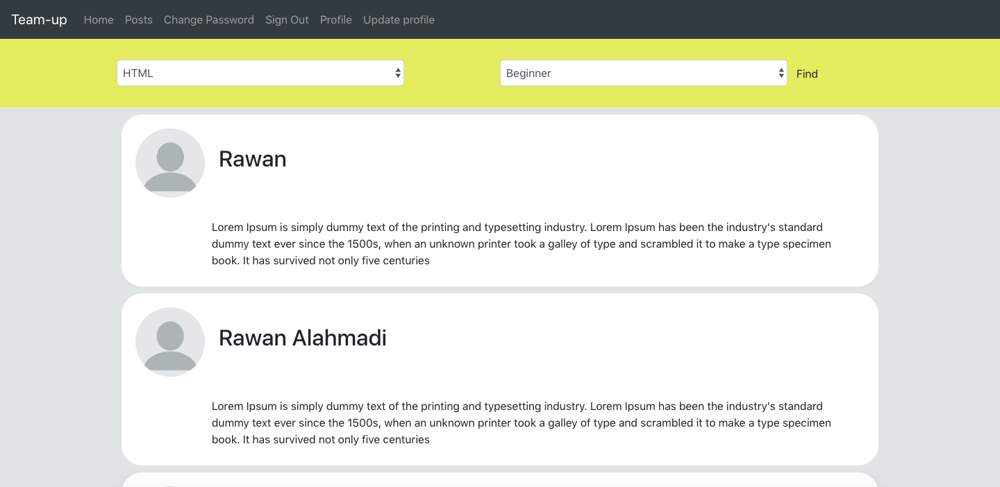
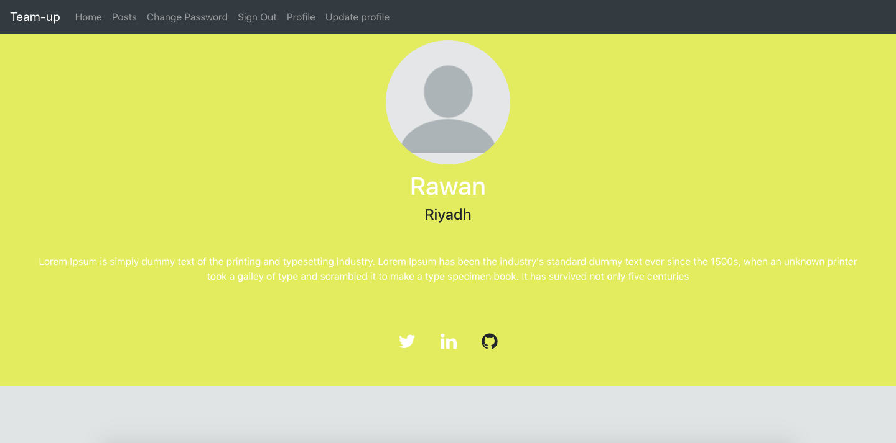
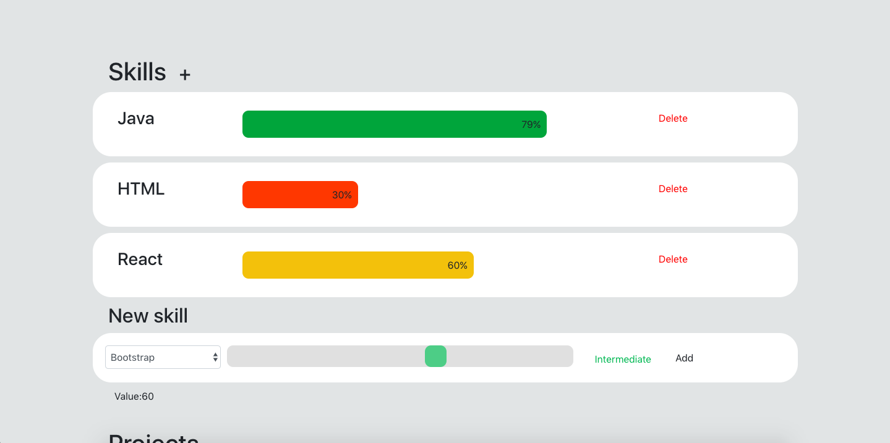
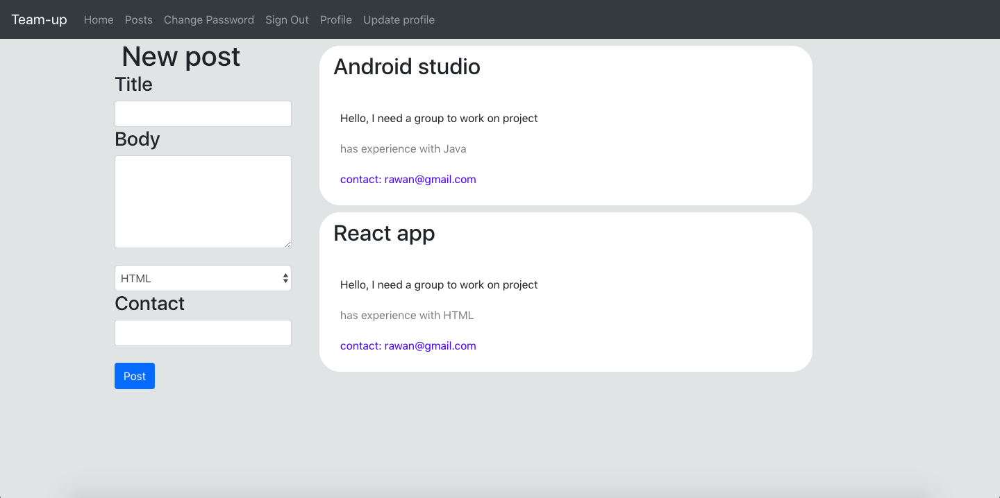

# Team-up

## About the App.
Team-up is a web app helps developer to team up, and find each other based on their skills.

## Project link
[Click here](http://rawanah995.github.io/react-project4)

## Technologies
* Express and Node.js as backend server.
* React as frontend.
* Sequelize.
* Bootstrap.

## Features:
* Finding users by their skills.

* Each user has a profile.

* Users can add and delete their skills 

* Users can post projects to find developers, and each post has a skill.

* The posts will appear differently for the users, only the posts that matching user skills will appear.

## Future work
## Work more on the posts feature:
- Add relation between posts and users. 
- Add many to many relation between posts and skills. 
- Work more on the interface design. 

## Add new features: 
- Users can chat and follow each other. 
- Users can add their projects on thier profile. 

## Thanks
* Thanks for my amazing instructors: Mike, Usman and Ghadeer.
* Thanks for my great class mates.

